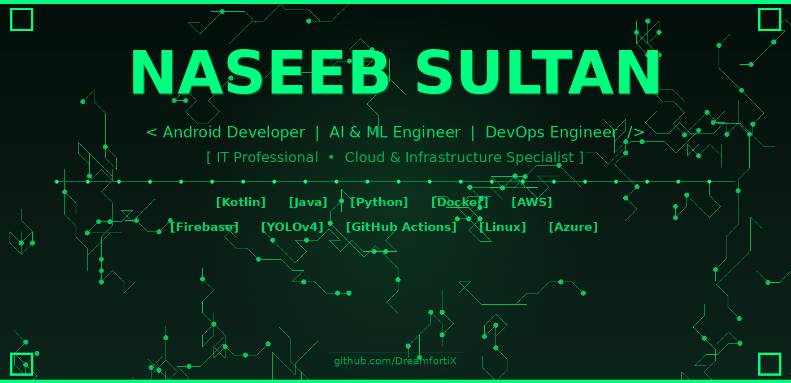

  

 

---

## 👨‍💻 About Me

> **"Passionate about building efficient, user-focused applications and solving real-world problems with technology."**

I am an **Information Technology graduate** with hands-on experience in **Android Application Development** using Kotlin and Java. I have a strong background in **Machine Learning**, **DevOps**, and **Cloud Computing**, with a passion for leveraging AI and automation to build impactful, scalable solutions.

- 🎓 **BSIT Graduate** — University of Sargodha | CGPA: 3.28/4.0
- 💼 **Currently:** Technical Support Engineer @ Sybrid Pvt Ltd, Lahore
- 📱 **Core Expertise:** Android Development, AI/ML, Firebase, DevOps, Cloud (AWS/Azure)
- 🌍 **Based in:** Lahore, Punjab, Pakistan
- 📞 **Phone:** +92 324 7397105

---

  
  
  
  

## ⚔️ Core Domains

  
  
  
  
  
  

| Capability | Tools & Technologies |
|---|---|
| 📱 **Android Development** | Kotlin, Java, Android Studio, MVVM, Room Database, Firebase |
| 🤖 **AI & Machine Learning** | Python, CNN, YOLOv4, Deep Learning, OpenCV, TensorFlow |
| 🛠️ **DevOps & CI/CD** | Docker, Docker Compose, Nginx, GitHub Actions, Infrastructure as Code |
| ☁️ **Cloud & Infrastructure** | AWS (EC2, S3, VPC, Polly), Azure, Git/GitHub |
| 🗄️ **Databases** | MySQL, MongoDB, Firebase (Firestore, Realtime DB, Auth, Storage) |
| 🛡️ **IT & Networking** | Windows, Linux (Ubuntu), Networking, Hardware Troubleshooting, ITSM |

---

## 🛠️ Tech Stack

### 📱 Mobile Development

`Kotlin` `Java` `Android Studio` `MVVM Architecture` `Room Database` `Firebase (Firestore, Auth, Storage, Realtime DB)` `Google Maps API`

### 🤖 AI & Machine Learning

`Python` `CNN` `YOLOv4` `Deep Learning` `OpenCV` `ML Model Integration`

### 🛠️ DevOps & CI/CD

`Docker` `Docker Compose` `Dockerfile` `Nginx Reverse Proxy` `GitHub Actions` `CI/CD Pipelines` `Infrastructure as Code` `Shell Scripting`

### ☁️ Cloud & Infrastructure

`AWS EC2` `Amazon S3` `Amazon VPC` `Amazon Polly` `Microsoft Azure` `Git/GitHub`

### 🗄️ Databases

`MySQL` `MongoDB` `Firebase Firestore` `Firebase Realtime Database`

### 🛡️ IT & Networking
`Windows OS` `Linux (Ubuntu)` `Network Configuration & Troubleshooting` `Hardware Diagnostics` `Cable Punching` `Patch Panel Configuration` `System Monitoring` `Microsoft Office Suite` `ITSM / Ticketing Tools`

---

## 💼 Work Experience

### 🏢 Sybrid Pvt Ltd — Lahore, Pakistan
**Technical Support Engineer** *(April 2026 – Present)*
- Provide 1st-level IT support, system maintenance, and software installation, troubleshooting hardware, software, and network issues to minimize downtime.
- Manage and resolve support tickets within SLA, documenting root causes and resolutions for recurring issues.
- Monitor systems for performance and security compliance, helping maintain organizational IT standards.

### 🏢 Premier Group of Companies — DI Khan, Pakistan
**IT Support** *(October 2025 – March 2026)*
- Delivered hardware support and system troubleshooting, including OS installation and maintenance, for an industrial sugar mill environment.
- Set up and maintained network infrastructure including cable punching, connector termination, and patch panel configuration.
- Diagnosed and resolved hardware faults, including printer and peripheral repairs, to maintain operational uptime.

### 🏢 HiskyTech — Sargodha, Pakistan
**Android Developer Intern** *(December 2024 – July 2025)*
- Developed Android applications using Kotlin and Java, including a QR Scanner Application and a Calculator Application.
- Contributed to the development and maintenance of the **Urdu Bolo** application by implementing features, fixing bugs, and improving performance.
- Worked with Android Studio, Firebase, APIs, and UI/UX components to build user-friendly mobile applications.
- Collaborated with the development team throughout the full application development lifecycle.

---

## 🚀 Projects

### 🧠 TongueTechAi — AI-Powered Tongue Cancer Detection *(Sep 2024 – Jun 2025)*
> Full-stack Web & Android application for early tongue cancer screening using AI-based image analysis.

- Built a **React.js** web frontend, **Kotlin** Android app, and **Python ML backend** for tongue cancer detection from medical images.
- Implemented **CNN and YOLOv4** models for lesion detection and classification, using **OpenCV** for image preprocessing.
- Developed backend APIs using **Node.js, Express.js, and MongoDB**; containerized the application with **Docker** for portable deployment.
- **Stack:** Kotlin, Android Studio, React.js, Node.js, Express.js, MongoDB, Python, CNN, YOLOv4, OpenCV, Docker

🔗 [GitHub Repository](https://github.com/DreamfortiX/TongueTechAi.git)

---

### ⚙️ CI/CD Pipeline for Full-Stack Web Application
> Automated build-and-deploy workflow using GitHub Actions.

- Set up an automated pipeline using **GitHub Actions** for a React + Python (Flask) application.
- Containerized frontend and backend with **Docker** and connected the pipeline to version-controlled deployments on Git/GitHub.
- **Stack:** React.js, Python Flask, Docker, GitHub Actions

---

### 🐳 Multi-Container Application Deployment
> Full-stack app deployment using Docker Compose.

- Deployed a multi-container full-stack app (React + Flask) using **Docker Compose**, with services managed and networked across containers.
- **Stack:** React.js, Python Flask, Docker, Docker Compose

---

### ☁️ AWS VPC — 2-Tier Architecture
> Secure cloud network design on AWS.

- Designed and built a custom **VPC** on AWS implementing a 2-tier architecture with public and private subnets.
- Configured an Internet Gateway, route tables, and Security Groups, and launched an **EC2** instance for secure network segmentation.
- **Stack:** AWS EC2, AWS VPC, Internet Gateway, Security Groups

---

### 🆘 Real-Time Distress Detection System *(Jun 2025 – Jul 2025)*
> Android app integrated with an IoT device for real-time safety monitoring.

- Used **Firebase Realtime Database** to receive heartbeat and distress data from an IoT device.
- Integrated a **Machine Learning model** to detect emergencies and automatically send SMS alerts with live location to emergency contacts.
- **Stack:** Kotlin, Android Studio, Firebase, Machine Learning, IoT, Google Maps API

🔗 [GitHub Repository](https://github.com/DreamfortiX/SafetApp_with_iot)

---

### 🛡️ AI-Powered Women Safety Application
> Android app for women's safety with real-time audio monitoring and emergency response.

- Collected and classified audio datasets into safe/danger categories and trained a custom **ML model** for threat detection.
- Implemented automatic emergency alerts with location sharing, SOS, contact management, and fake-call features.
- **Stack:** Kotlin, Android Studio, Firebase, Machine Learning, Google Maps API, Cloud Storage

🔗 [GitHub Repository](https://github.com/DreamfortiX/GirlsSafe)

---

## 🎓 Education

**Bachelor of Science in Information Technology (BSIT)**
*University of Sargodha, Pakistan* | Sep 2021 – Jun 2025
📍 Sargodha, Pakistan | **CGPA: 3.28/4.0** | EQF Level 6 | 130 Credits

**Relevant Coursework:** Android Development, Machine Learning, Data Structures, Database Systems, Cloud Computing, Network Administration, Information Security, Web Development.

---

## 📜 Certifications

- 🏅 **AWS Cloud Practitioner**
- 🏅 **Android Development** — HiskyTech *(Sep 2024)*
- 🏅 **Basics of Database** — HiskyTech *(Sep 2024)*
- 🏅 **Basics of Python**

---

## 🌐 Languages

- 🇬🇧 **English**
- 🇵🇰 **Urdu**

---

## ⚡ GitHub Stats

  

 

  

---

## 🤝 Let's Connect

I'm open to collaboration on Android development, AI/ML projects, or DevOps engineering. Feel free to reach out:

- 📧 **Email:** [naseeb.sultan9295.it@gmail.com](mailto:naseeb.sultan9295.it@gmail.com)
- 💻 **GitHub:** [github.com/DreamfortiX](https://github.com/DreamfortiX)
- 💼 **LinkedIn:** [linkedin.com/in/naseeb-sultan92](https://www.linkedin.com/in/naseeb-sultan92/)
- 🌐 **Portfolio:** [dreamfortix.github.io/MY_PORTFOLIO](https://dreamfortix.github.io/MY_PORTFOLIO/)
- 📞 **Phone:** +92 324 7397105
- 📍 **Location:** Lahore, Punjab, Pakistan

 

> ***"Building efficient, user-focused applications and solving real-world problems — one project at a time."***
>
> **— Naseeb Sultan**

  

